# OpenCode Wallpapers

Animated wallpapers for the OpenCode terminal UI. A slow, quiet scene fills the background behind everything, drawn
with Unicode block characters and kept readable behind text.

> This project is not affiliated with, endorsed by, or sponsored by OpenCode or its maintainers.

| | Day | Sunset | Night |
| --- | --- | --- | --- |
| Ocean | 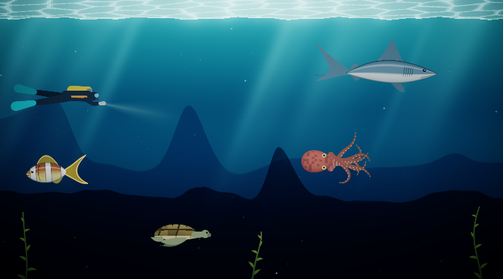 | 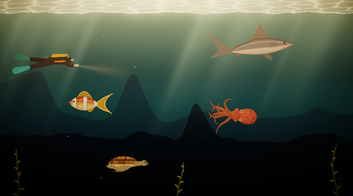 | 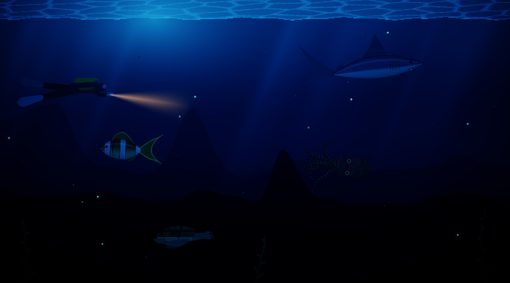 |
| Desert | 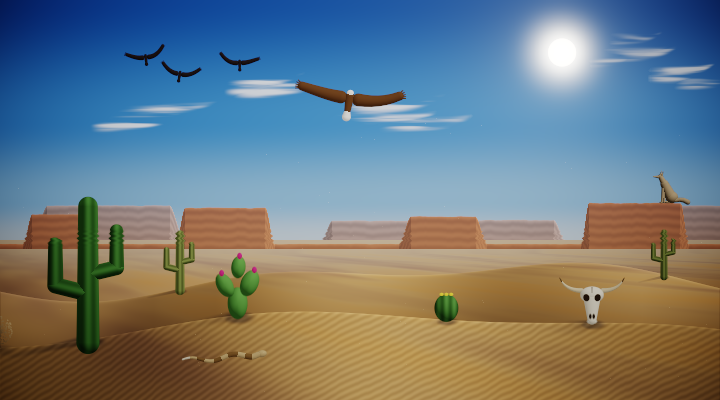 | 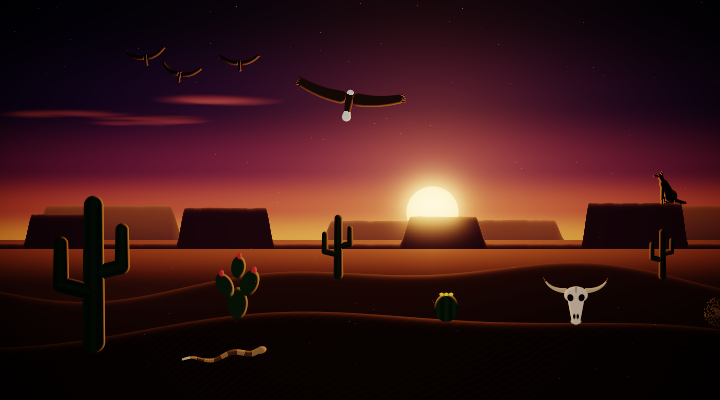 | 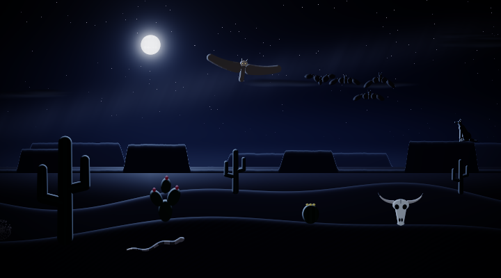 |
| Jungle | 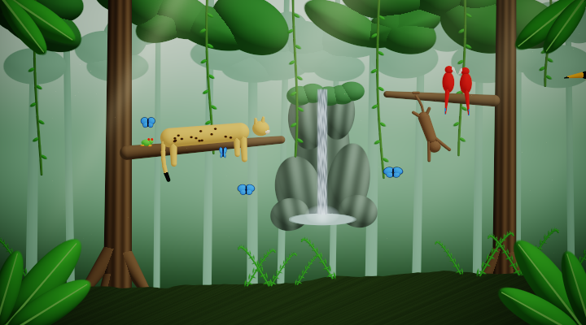 | 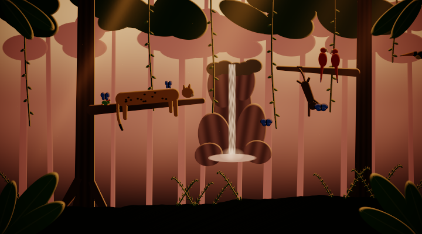 | 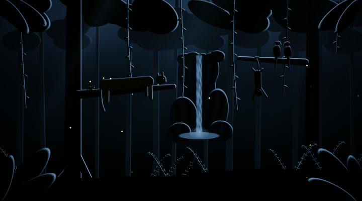 |
| Space | 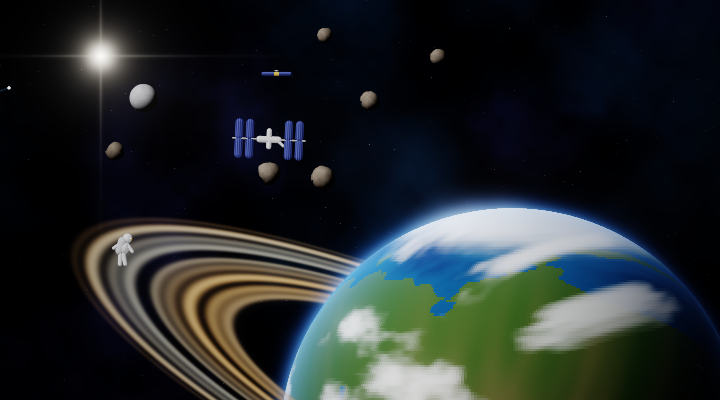 | 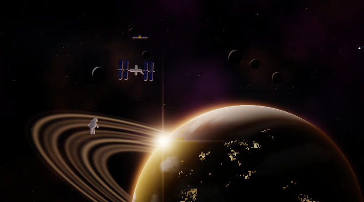 | 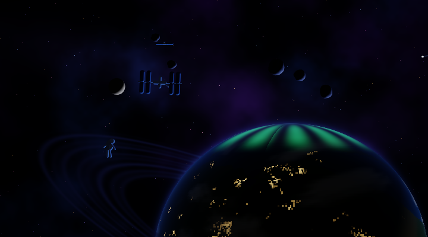 |
| Farm |  | 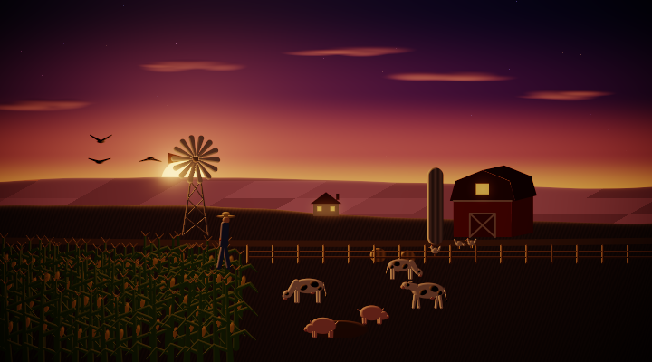 | 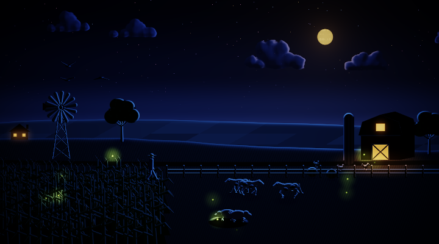 |
| Tundra | 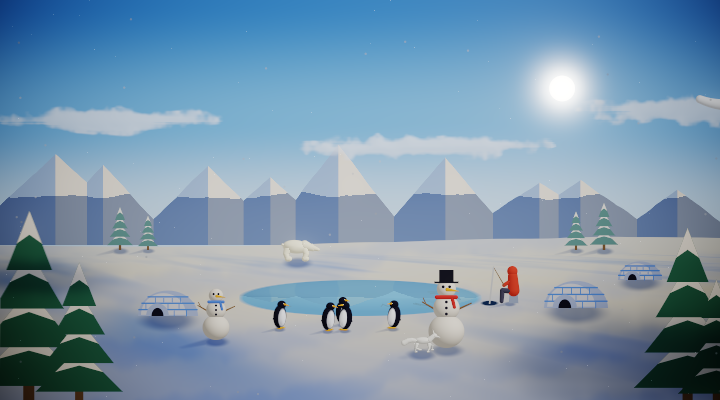 | 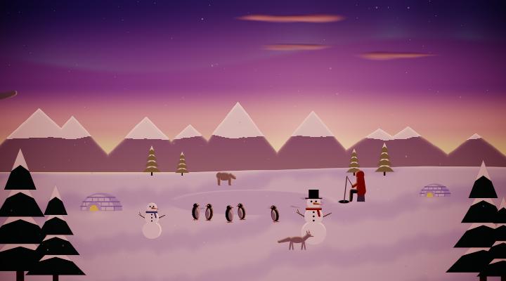 | 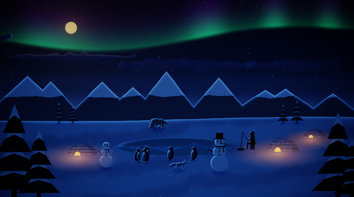 |
| Beach | 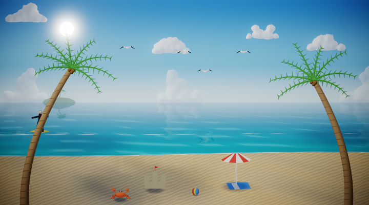 | 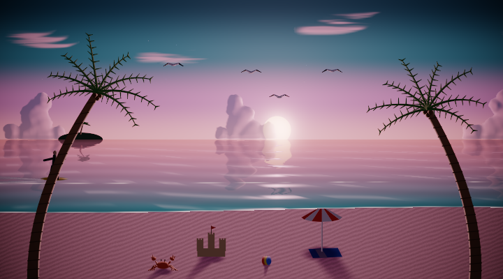 | 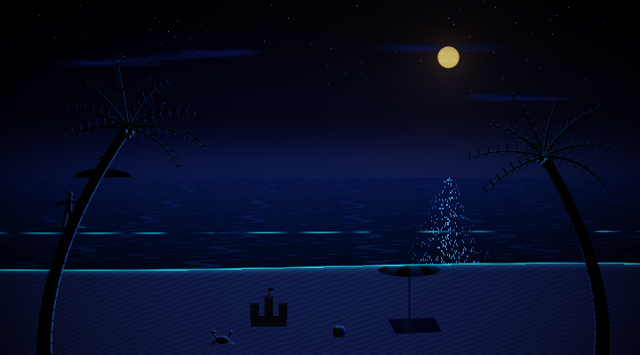 |

## Wallpapers

| Wallpaper | Description |
| --- | --- |
| `ocean` | Deep water, god rays, marine snow, and a whale that drifts past now and then. |
| `desert` | Mesas and dunes with a saguaro, a cow skull, and a tumbleweed now and then. |
| `jungle` | A misty rainforest with a waterfall, light through the canopy, and a toucan flying by now and then. |
| `space` | A ringed planet turning slowly below a nebula and drifting stars, with a comet now and then. |
| `farm` | Rolling fields with a red barn, a turning windmill and swaying corn, and a tractor now and then. |
| `tundra` | Snowy peaks, a frozen lake, igloos and a snowman under falling snow, with a snowy owl now and then. |
| `beach` | Waves washing up a sandy beach between swaying palms, with a sailboat on the horizon now and then. |

## Install

Requires OpenCode 2. Clone the repository into OpenCode's plugin directory and restart OpenCode:

```sh
git clone https://github.com/vaprdev/opencode-wallpapers.git ~/.config/opencode/plugins/wallpapers
```

To keep the clone elsewhere, add its absolute path to `plugins` in `~/.config/opencode/cli.json` instead:

```json
{
  "plugins": ["/path/to/opencode-wallpapers"]
}
```

Update with `git pull` in the clone.

## Use

Type `/wallpaper` to open the wallpaper menu:

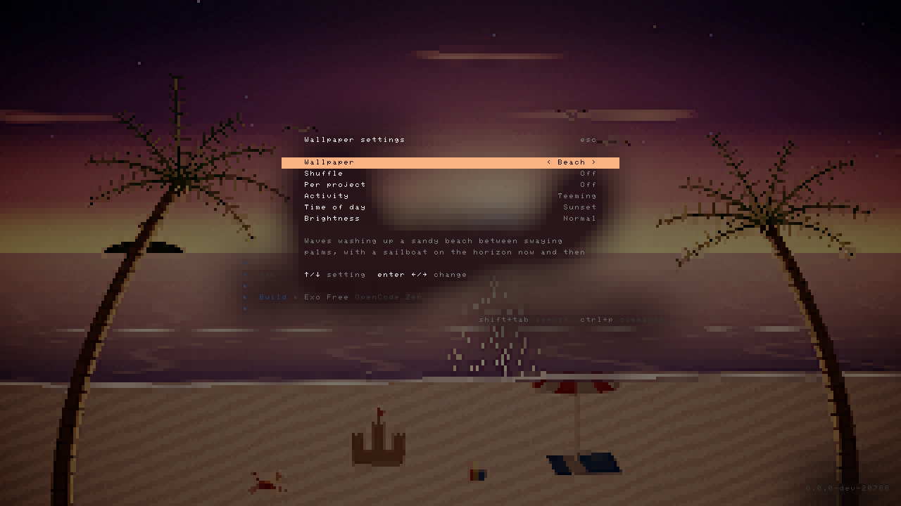

Use ↑/↓ to pick a setting, and Enter or ←/→ to change it. The wallpaper changes as you go, and Escape closes the
menu. Your choice is kept across restarts.

## Activity

Every wallpaper has three activity levels, which set how much is going on behind your work:

| Wallpaper | Calm | Lively | Teeming |
| --- | --- | --- | --- |
| `ocean` | Water, light and the whale | Adds a fish and an octopus | Adds a shark, diver, turtle and kelp |
| `desert` | Mesas, a saguaro and a skull | Adds a soaring eagle (an owl at night) and a rattlesnake | Adds vultures (bats at night), a howling coyote and more cacti |
| `jungle` | Trees, vines, a waterfall and swaying leaves | Adds a swinging spider monkey and blue morpho butterflies | Adds a jaguar, scarlet macaws, a tree frog and more butterflies |
| `space` | The planet, its rings, a moon and the stars | Adds an orbiting space station and a satellite | Adds asteroids, a floating astronaut and a flying saucer |
| `farm` | Barn, windmill, fields and corn | Adds grazing cows and pecking chickens | Adds a farmer, pigs in the mud and crows over the corn |
| `tundra` | Peaks, igloos, a snowman and falling snow | Adds waddling penguins and an arctic fox | Adds a polar bear, an ice fisher and another snowman |
| `beach` | Sea, waves, sand and palm trees | Adds leaping dolphins and seagulls | Adds a crab, a surfer, an umbrella and a sandcastle |

## Time of day

Every wallpaper has a day, sunset and night look. By default the time of day follows your clock: day from 7am,
sunset from 6pm (and at dawn, 6 to 7am), night from 8pm. Pick one in the menu to keep it fixed.

- **Ocean:** sunlit water by day, golden light at sunset, and at night dark moonlit water with glowing plankton
  and, in teeming, a diver's torch.
- **Desert:** a high sun with sunlit rock and shadows by day, backlit silhouettes at sunset, and a moonlit night with
  stars and the Milky Way, where an owl and bats take over the sky.
- **Jungle:** sunlit greens by day, warm backlit mist at sunset, and a moonlit night lit by fireflies, where the
  jaguar's eyes glow.
- **Space:** the planet's sunlit side by day, an orbital sunrise with the star flaring at its edge at sunset, and its
  night side with city lights and aurora under a bright Milky Way.
- **Farm:** sunny fields by day, a backlit barn at sunset, and a moonlit night with glowing windows and fireflies.
- **Tundra:** crisp blue-white snow by day, pink alpenglow at sunset, and deep blue snow under a green and violet
  aurora at night, with warm light from the igloos.
- **Beach:** turquoise water by day, a glittering path under the setting sun, and a moon path at night with glowing
  bioluminescent waves.

## Seasons

By default the season follows the calendar: spring from March, summer from June, autumn from September, winter from
December. They flip for a location (see Weather) in the southern hemisphere: given as `latitude,longitude`, or as a
place name once Local weather has looked it up. Pick a season in the menu to keep it fixed.

- **Farm:** blossom, wildflowers and young corn in spring; ripe corn and fireflies in summer; gold fields, dry corn,
  pumpkins and falling leaves in autumn; snow on the fields, roofs and bare trees in winter, with a light flurry.
- **Desert:** a wildflower bloom and flowering saguaros in spring, and a dusting of snow on the mesas in winter.
- **Jungle:** the rainy season (summer and autumn) brings thicker mist, a fuller waterfall and a light shower.
- **Beach:** a crowd of umbrellas, sunbathers and swimmers in summer, and an empty beach with cooler water in autumn and
  winter.
- **Ocean, space and tundra** look the same all year: underwater, in orbit and on the ice there is no season to show.

| Spring | Summer | Autumn | Winter |
| --- | --- | --- | --- |
| 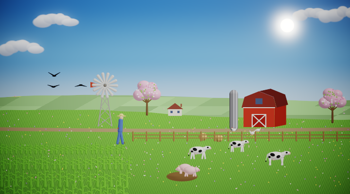 | 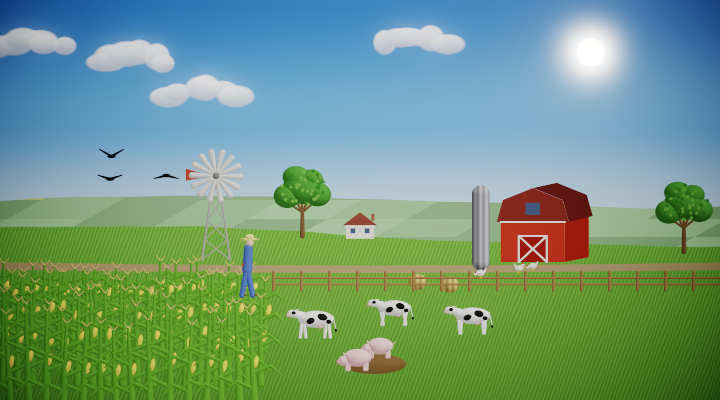 | 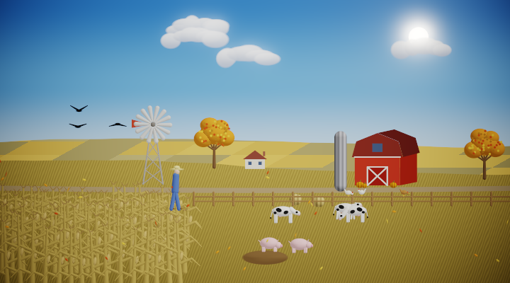 | 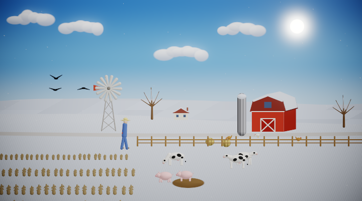 |

## Weather

Outdoor wallpapers (desert, jungle, farm, tundra and beach) can show rain with splashes, snow, fog or overcast skies. At
night, rain and snow are tinted blue rather than white. The menu's weather setting:

- **Off** (the default): each wallpaper's own weather, such as the tundra's snowfall and the seasonal showers above.
- **Local**: the real weather where you are, from [Open-Meteo](https://open-meteo.com) (free, no API key), checked at
  most every 30 minutes. It needs a place: `/wallpaper location Berlin` or `/wallpaper location 52.52,13.41`, or the
  `WALLPAPER_LOCATION` variable. Nothing is fetched unless you pick Local, your location is never guessed, and if the
  lookup fails the sky stays clear.
- **Clear, Rain, Snow, Fog**: always that weather. `/wallpaper weather overcast` is also available.

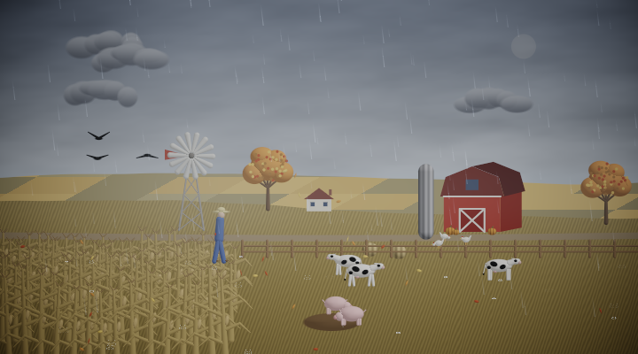

## Terminals

Any truecolor terminal works. Ghostty and kitty get octant characters (2x4 sub-pixels per cell); other terminals get
quadrant blocks (2x2). These environment variables tune rendering:

| Variable | Effect |
| --- | --- |
| `WALLPAPER_PIXELS=1` | In Ghostty or kitty, draw the scene as a real image behind the text instead of characters |
| `WALLPAPER_SUPERSAMPLE=2` | Smoother edges in character mode, at about 2.5x the CPU |
| `WALLPAPER_OCTANTS=0` or `1` | Force quadrant or octant characters |
| `WALLPAPER_LOCATION` | A place or `latitude,longitude` for local weather, if none is set with `/wallpaper location` |

## How it works

The plugin post-processes each frame OpenCode draws. Cells painted with OpenCode's neutral surface colors are replaced
by the scene, while colored backgrounds such as diffs and selections are left alone. Text keeps a soft scrim that fades
the scene toward a dark tint around it. Scenes render in HDR with bloom and tone mapping, then are fitted to two colors
per character cell. Wallpapers update at 15 frames per second.

## Add a wallpaper

1. Create `wallpapers/<id>.ts`. Extend `Canvas` from `src/canvas.ts`, implement `step(dt)` and `render()`, and export
   a `Wallpaper` with an id, name, description, scrim colors for each time of day, what each activity level shows, and
   `create({ activity, time, season, weather })`. Without a season, show the classic look.
   `wallpapers/ocean.ts` is the example. Outdoor scenes get weather from a `WeatherLayer` (`src/weather.ts`):
   `cover()` after painting the sky, `step()`, and `draw()` before `finish()`; `wallpapers/farm.ts` shows it.
2. Add it to `wallpapers/index.ts`.
3. Check it:

```sh
bun install
bun run typecheck
bun dev/check.ts <id>            # errors, frame cost, and flicker at every activity level and time of day
bun dev/snap.ts <id> teeming night 30  # scene PNGs at an activity level, time of day, and times
bun dev/snap.ts <id> winter snow 30    # ...also by season and weather; check.ts and preview.ts take them too
bun dev/preview.ts <id> 20       # terminal-cell rendering behind text, as a PNG
bun dev/pixel-check.ts <id>      # real-pixel mode against a mock kitty renderer
```

`dev/pty.ts` and `dev/pty-kitty.ts` drive a real OpenCode in a pseudo-terminal, and `WALLPAPER_DUMP=<file>` saves one
frame of terminal cells that `dev/cells.ts` turns into a PNG.

## License

[MIT](LICENSE)
