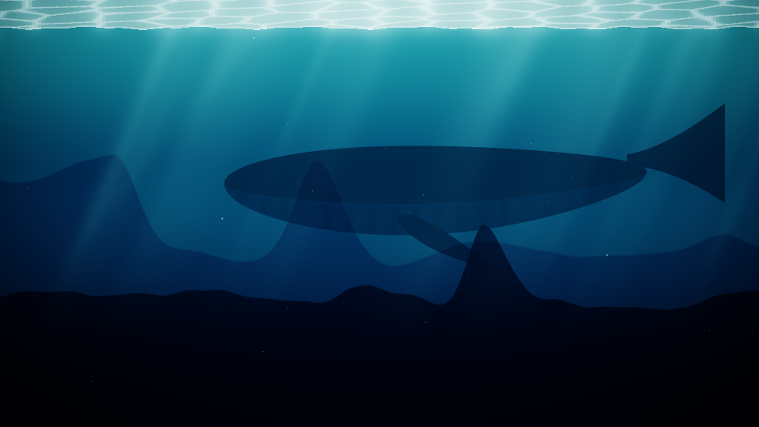

# OpenCode Wallpapers

Animated wallpapers for the OpenCode terminal UI. A slow, quiet scene shows through the sidebar, prompt, and other
panels (or the whole background), drawn with Unicode block characters and kept readable behind text.

> This project is not affiliated with, endorsed by, or sponsored by OpenCode or its maintainers.



## Wallpapers

| Wallpaper | Description |
| --- | --- |
| `aquarium` | Deep water, god rays, marine snow, and a whale that drifts past now and then. |

## Install

Requires OpenCode 2. Clone the repository into OpenCode's plugin directory and restart OpenCode:

```sh
git clone https://github.com/vaprdev/opencode-wallpapers.git ~/.config/opencode/plugins/wallpapers
```

To keep the clone elsewhere, add its absolute path to `plugins` in `~/.config/opencode/cli.json` instead:

```json
{
  "plugins": ["/path/to/opencode-wallpapers"]
}
```

Update with `git pull` in the clone.

## Use

| Command | Effect |
| --- | --- |
| `/wallpaper` | Open a picker with every wallpaper, off, activity level, and where to show it |
| `/wallpaper aquarium` | Switch to a wallpaper by id |
| `/wallpaper off` | Turn the wallpaper off |
| `/wallpaper calm` | Scenery with rare events (default) |
| `/wallpaper lively` | A few creatures |
| `/wallpaper teeming` | The full cast |
| `/wallpaper panels` | Show it only inside panels: sidebar, prompt, notices (default) |
| `/wallpaper behind` | Show it behind everything, including the conversation |

The same actions are in the command palette under **Wallpapers**. Your choice persists across restarts.

## Activity

Every wallpaper has three activity levels, which set how much is going on behind your work:

| Wallpaper | Calm | Lively | Teeming |
| --- | --- | --- | --- |
| `aquarium` | Water, light and the whale | Adds a fish and an octopus | Adds a shark, diver, turtle and kelp |

## Terminals

Any truecolor terminal works. Ghostty and kitty get octant characters (2x4 sub-pixels per cell); other terminals get
quadrant blocks (2x2). These environment variables tune rendering:

| Variable | Effect |
| --- | --- |
| `WALLPAPER_PIXELS=1` | In Ghostty or kitty, draw the scene as a real image behind the text instead of characters |
| `WALLPAPER_SUPERSAMPLE=2` | Smoother edges in character mode, at about 2.5x the CPU |
| `WALLPAPER_OCTANTS=0` or `1` | Force quadrant or octant characters |

## How it works

The plugin post-processes each frame OpenCode draws. Cells painted with OpenCode's neutral surface colors are replaced
by the scene, while colored backgrounds such as diffs and selections are left alone. Text keeps a soft scrim that fades
the scene toward a dark tint around it. Scenes render in HDR with bloom and tone mapping, then are fitted to two colors
per character cell. Wallpapers update at 15 frames per second.

## Add a wallpaper

1. Create `wallpapers/<id>.ts`. Extend `Canvas` from `src/canvas.ts`, implement `step(dt)` and `render()`, and export
   a `Wallpaper` with an id, name, description, scrim colors, what each activity level shows, and `create(activity)`.
   `wallpapers/aquarium.ts` is the example.
2. Add it to `wallpapers/index.ts`.
3. Check it:

```sh
bun install
bun run typecheck
bun dev/check.ts <id>            # errors, frame cost, and flicker at every activity level
bun dev/snap.ts <id> teeming 30  # scene PNGs at an activity level and times
bun dev/preview.ts <id> 20       # terminal-cell rendering behind text, as a PNG
bun dev/pixel-check.ts <id>      # real-pixel mode against a mock kitty renderer
```

`dev/pty.ts` and `dev/pty-kitty.ts` drive a real OpenCode in a pseudo-terminal, and `WALLPAPER_DUMP=<file>` saves one
frame of terminal cells that `dev/cells.ts` turns into a PNG.

## License

[MIT](LICENSE)
